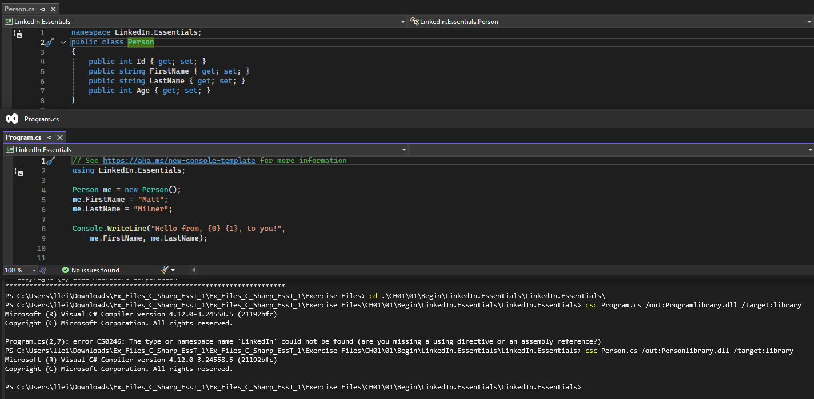

## C# in Context of .NET
- C# and MSIL: C# code compiles to Microsoft Intermediate Language (MSIL), which is a common language for .NET languages like F# and Visual Basic .NET.
- Runtime Flexibility: The C# language can evolve independently of the .NET runtime, allowing for flexibility and growth.
- ILDASM: can be used to inspect the compiled code.
- Execution of MSIL: The .NET runtime is responsible for executing the Microsoft Intermediate Language (MSIL) compiled from C# or other .NET languages.
- Cross-Platform Compatibility: Recent versions of the .NET runtime, starting with .NET Core, are cross-platform, allowing applications to run on Windows, Linux, and Mac OS.
- Bundled Runtime: The .NET runtime can be bundled with your application, simplifying deployment and managing dependencies across different platforms.
- Common Functionality: The Base Class Library (BCL) provides common functionality for .NET languages, including string manipulation, mathematical functions, and working with dates.
- Complex Functions: It also includes more complex functionalities like file handling, network streams, and data access.
- Reuse and Extensibility: Developers often build reusable libraries on top of the BCL for their applications, combining direct calls to BCL types with custom libraries.
- Third-Party Libraries: Modern development frequently involves using third-party libraries alongside the BCL to enhance application functionality.
- NuGet.org and Package Manager: NuGet.org is a repository for libraries, and the NuGet package manager is a tool for creating and installing these packages in projects.
- Ease of Use: NuGet simplifies the distribution and management of libraries, ensuring proper versioning, security, and compatibility with different .NET versions.
- Integration with Visual Studio: Visual Studio supports NuGet for both creating and consuming packages, making it easy to manage libraries within your projects

### Complile the code
#### Compile a file into a library (dll)

1. Open Visual Studio
2. In the terminal, enter: `csc Person.cs /out:Personlibrary.dll /target:library`
#### Compile multiple source files into an executable
`csc Person.cs Program.cs /out:hello.exe /target:exe`

Above two command lines will generate a dll or exe file in the same directory of your project.
`dotnet run` and "Build" in Visual Studio will create a folder with multiple files, including exe, dll, etc.

---

## Classes, Structs, and Records
- **Classes**: Defined as **reference types**, meaning variables point to the instance of the class. They can implement interfaces and have additional properties.
- **Structs**: Defined as **value types**, meaning variables hold the actual data. They can also implement interfaces but cannot inherit from other structs.
- **Records**: Introduced in C# 9, intended for **immutable objects** and often used for **data objects**. They can have inheritance and are useful for scenarios where you need to pass objects with state between layers.

### Definition
#### Classes
Definition: Reference types that point to an instance of the class.

Use Case: Use classes when you need to create complex objects that may have shared behavior and state, such as representing an employee in a company.


#### Structs
Definition: Value types that hold the actual data.

Use Case: Use structs for small, simple objects that represent a single value or a group of related values, such as a point in a 2D space or an age.


#### Records
Definition: Introduced in C# 9, intended for immutable objects and often used for data transfer.

Use Case: Use records when you need to create immutable data objects that are primarily used for holding data and passing it around, such as a customer record in a database.


#### Interfaces
Definition: Define a contract that classes or structs can implement.

Use Case: Use interfaces to define a set of methods and properties that must be implemented by any class or struct that implements the interface, providing a way to enforce certain behaviors across different types.


#### Record struct
A record struct is a type introduced in C# 10 that combines the features of records and structs. Here are the key points:

Definition: A record struct is a value type like a struct but has the immutability and data-centric features of a record.

Use Case: Use record structs when you need a value type that benefits from the immutability and concise syntax of records. They are ideal for scenarios where you need to pass around data objects that should not be modified, such as an order in a transaction system.

### Record class
A record class in C# is a reference type introduced in C# 9, designed for scenarios where you need immutable objects. Here's a summary based on the video:

Definition: A record class is similar to a regular class but is intended for creating immutable objects.

Example:
csharp
public record Customer(string FirstName, string LastName, int ID, int Age);

Use Case: Record classes are useful for data objects that you want to pass around without modifying, such as customer records in a database or data transfer objects in an application.

```
namespace LinkedIn.Essentials;

public interface IPerson {
    public string FirstName { get; set; } 
    public string LastName { get; set; } 
    public int Id { get; set; } 
    public Age Age { get; set; } 
}

//classes - reference types
public class Employee : IPerson { 
    public string LastName { get; set; } 
    public int Id { get; set; } 
    public Age Age { get; set; } 
    public string FirstName { get; set; }

    //employee properties
    public int EmployeeId { get; set; }
    public DateOnly StartDate { get; set; }
    public TimeOnly ShiftStartTime { get; set; }
}  

public class Manager : Employee, IPerson 
{
    public int NumberOfDirectReports { get; set; }
}

//structs - value types
public struct Age
{
    public DateTime BirthDate { get; set; }
    public int YearsOld { get; set; }
}
    
public struct VendorContact : IPerson { 
    public string LastName { get; set; }        
    public int Id { get; set; }        
    public Age Age { get; set; }        
    public string FirstName { get; set; }
}

//records (C# 9)
public record Customer : IPerson
{
    public string LastName { get; set; }
    public int Id { get; set; }
    public Age Age { get; set; }
    public string FirstName { get; set; }
}

public record PremiereCustomer : Customer
{
    public byte CustomerLevel { get; init; }
}

//record structs (C# 10)
public record struct Order
{
    public int OrderId { get; set; }
    public DateOnly OrderDate { get; set; }

}
public record struct RecurringOrder
{

}

```

### Defining Constructors
- Defining Constructors: You can define constructors in your classes to initialize objects with specific parameters. For example, public Employee(string firstName, string lastName) initializes an Employee object with a first and last name.
- Default Constructors: If you define a custom constructor, the compiler does not automatically create a default (parameterless) constructor. You need to explicitly define it if needed.
- Base Constructors: When dealing with inheritance, you can call the base class constructor using the base keyword to ensure the base class is properly initialized.

Example:
```
public class Employee : IPerson {
    //public Employee()
    //{}
    public Employee(string firstName, string lastName, 
        int empId = 0)
    {
        LastName = lastName;
        FirstName = firstName;
        EmployeeId = empId;
    }
    ...
}  

public class Manager : Employee, IPerson 
{
    public Manager(string firstName, string lastName) : base(firstName, lastName)
    {}
    public int NumberOfDirectReports { get; set; }
}
```

### Object Initialization
- Object Initialization Syntax: You can use curly braces {} to initialize an object's properties directly, making it more concise and readable.
- Default Constructor Requirement: When using object initialization, a default constructor is needed to create the object before setting properties.
- Combining Constructors and Initialization: You can mix and match constructor parameters with object initialization to set additional properties not covered by the constructor.

Example 1: Basic Object Initialization
```
// instead of 
Employee e = new Employee("Matt", "Milner", 5);

// Use
Employee employee = new Employee
{
    FirstName = "Matt",
    LastName = "Milner",
    EmployeeID = 75,
    StartDate = new DateOnly(2023, 1, 1)
};

// but need to use default constructor
public class Employee : IPerson {
    public Employee()
    {}

    // can keep this
    public Employee(string firstName, string lastName, 
        int empId = 0)
    {
        LastName = lastName;
        FirstName = firstName;
        EmployeeId = empId;
    }
    ...
}

// in the default constructor, you can do something like:
public Employee()
    {
        Id = 5;
    }

```

Example 2: Combining Constructor and Initialization
```
Employee employee = new Employee("Matt", "Milner", 75)
{
    StartDate = new DateOnly(2023, 1, 1)
};
// Constructor sets FirstName, LastName, and EmployeeID, then StartDate is set
```

### Initialize only Properties
- Init-Only Properties: These properties can only be set during object initialization and not modified afterward. This ensures immutability after the object is created.

- Usage: You can use the init keyword in place of set to define init-only properties.

Example:
```
public record PremiereCustomer : Customer
{
    // for PremiereCustomer pcust = new PremiereCustomer { CustomerLevel = 2};
    public PremiereCustomer()
    {}
    // for PremiereCustomer pcust = new PremiereCustomer (2);
    public PremiereCustomer(byte level)
    {
        CustomerLevel = level;
    }
    public byte CustomerLevel { get; init; }
}

...
//PremiereCustomer pcust = new PremiereCustomer (2);
PremiereCustomer pcust = new PremiereCustomer { CustomerLevel = 2};
pcust.FirstName = "New Customer";
```

This allows setting FirstName and CustomerLevel only during initialization.

**private set**: use constructor to init var
```
public class Manager : Employee, IPerson 
{
    public Manager(string firstName, string lastName) : base(firstName, lastName)
    {}
    public void SetReports(int numberOfReports)
    {
        NumberOfDirectReports = numberOfReports;
    }
    public int NumberOfDirectReports { get; private set; }
}

...
Manager m = new Manager("manager", "boss");
m.SetReports(7);
```

### Cloning and Copying Objects
Reference Types: When you assign one reference type variable to another, both variables point to the same object in memory. Changes to one will affect the other.
Value Types: Assigning one value type variable to another creates a copy. Changes to one do not affect the other.
Using ref Keyword: The ref keyword allows changes to a reference type within a method to persist outside the method.

```
Employee me = new Employee { FirstName = "Matt", Age = 50 };
Employee other = me;
other.FirstName = "Bizarro Matt";
other.Age = 39;
Console.WriteLine($"{me.FirstName} is {me.Age} years old"); // Output: Bizarro Matt is 39 years old
Console.WriteLine($"{other.FirstName} is {other.Age} years old"); // Output: Bizarro Matt is 39 years old
```
Both me and other point to the same object, so changes to other affect me.


Inside method and outside method example
```
static void ChangeName( IPerson person)
{
    person.LastName = "Unknown";
    Console.WriteLine($"Person in method is {person.FirstName} {person.LastName}"); // Output: Person in method is Bizarro Matt Unknown

    person = new Manager("Manager", "Milner")
    {
        Id = 2,
        Age =
        new Age { BirthDate = new DateTime(1990, 1, 1), YearsOld = 31 }
    };

    Console.WriteLine($"Person after reference change in method is {person.FirstName}"); // Output: Person after reference change in method is Manager
}

...
ChangeName(other);
Console.WriteLine($"{other.FirstName} {other.LastName} is still {other.Age.YearsOld}"); // Output Bizarro Matt Unkown is still 39
```
Inside method will change the reference variables (object) but will not change the reference.


Using ref Keyword Example
```
void ChangeName(ref Employee person)
{
person = new Employee { FirstName = "Manager", Age = 31 };
}

Employee other = new Employee { FirstName = "Bizarro Matt", Age = 39 };
ChangeName(ref other);
Console.WriteLine($"{other.FirstName} is {other.Age} years old"); // Output: Manager is 31 years old
```

Using ref allows the method to change the reference to a new object, and this change persists outside the method.


Value Types Example
```
int myAge = 50;
int anotherAge = myAge;
anotherAge = 39;
Console.WriteLine(myAge); // Output: 50
Console.WriteLine(anotherAge); // Output: 39
```

```
static void Structs()
{
    Console.WriteLine("=========== Structs = value types ===========");

    Age myAge = new Age { BirthDate = new DateTime(1971, 9, 1), YearsOld = 50 };
    Age anotherAge = myAge;

    anotherAge.YearsOld = 39;

    Console.WriteLine($"My age is {myAge.YearsOld}, but I changed it to {anotherAge.YearsOld}"); // Output: My age is 50, nut I changed it to 39

    AgeBackwords(ref anotherAge, 5);

    Console.WriteLine($"Now I am {anotherAge.YearsOld}"); // Output: Now I am 39
    Console.WriteLine();
}

static void AgeBackwords(ref Age startingAge, int numberOfYearsToAge)
{
    startingAge.YearsOld = startingAge.YearsOld - numberOfYearsToAge;
    Console.WriteLine($"Modified age in method: {startingAge.YearsOld}"); // Output: Modified age in method: 34
}

```

myAge and anotherAge are independent copies, so changes to anotherAge do not affect myAge.


```
static void Records()
{
    Console.WriteLine("=========== Records = reference or value types ===========");

    PremiereCustomer pc = new PremiereCustomer
    {
        FirstName = "Customer",
        LastName = "One",
        Id = 7,
        Age = new Age { BirthDate = DateTime.Now, YearsOld = 1 },
        CustomerLevel = 1
    };

    PremiereCustomer pc2 = pc with { CustomerLevel = 2, LastName = "Two" };

    Console.WriteLine($"{pc.FirstName} {pc.LastName} has a level of {pc.CustomerLevel}"); // Output: Customer One has a level of 1
    Console.WriteLine($"{pc2.FirstName} {pc2.LastName} has a level of {pc2.CustomerLevel}"); // Output: Customer Two has a level of 2
    ChangeName((IPerson)pc);
    // inside changeName:
    // Output: Person in method is Customer Unknown
    // Output Person after reference change in method is Manager
    Console.WriteLine($"{pc.FirstName} {pc.LastName} is still {pc.Age.YearsOld}"); // Output: Customer Unkown is still 1

}
```

Recods work like class or strcut depending on how you define them, can be reference type or value type

### Equality Comparison
- Classes: Equality comparisons for classes are based on **reference equality**. Two class instances are considered equal if they reference the same object.
- Structs: By default, structs use **value equality**, abd they do not support equality comparisons using the == operator. You can define custom equality operators to compare the values of struct instances.
- Records: Records use **value equality** by default, meaning two record instances are considered equal if their values are the same, even if they are different objects.

Example of custom equality operators:
```
public struct SPoint
{
    public int X { get; set; }
    public int Y { get; set; }

    // create customed operator
    public static bool operator == (SPoint a, SPoint b) => a.X == b.X   &&  a.Y == b.Y;
    public static bool operator != (SPoint a, SPoint b) => a.X != b.X   ||  a.Y != b.Y;
}

static void Structs()
{
    Console.WriteLine("=================Structs=================");
    SPoint p1 = new SPoint { X = 7, Y = 3 };
    SPoint p2 = p1;

    // use customed operator
    Console.WriteLine($"P1 = P2: {p1 == p2}");
    // if value comparison:
    Console.WriteLine($"P1 = P2: {p1.equals(p2)}");
    

    SPoint p3 = new SPoint { X = 7, Y = 3 };

    Console.WriteLine($"P1 = P3: {p1 == p3}");
    Console.WriteLine();
}
```

### Abstract Class
- Abstract Classes: These are base classes that cannot be instantiated directly. They are meant to be inherited by other classes that provide implementations for the abstract methods.
- Abstract Methods: Methods declared in an abstract class without an implementation. Derived classes must override these methods and provide an implementation.
- Virtual Methods: Methods in an abstract class that have a default implementation but can be overridden by derived classes.
- Usage in Derived Classes: Derived classes must implement abstract methods from the base class. They can also override virtual methods or create new implementations.
- Can't create instance

Here are the key differences between an interface and an abstract class in C#:

| Feature          | Abstract Class                                                                                        | Interface                                                                                               |
| ---------------- | ----------------------------------------------------------------------------------------------------- | ------------------------------------------------------------------------------------------------------- |
| Methods          | Can contain both abstract methods (without implementation) and concrete methods (with implementation) | Can only contain method signatures (no implementation), properties, events, and indexers                |
| Fields           | Can have fields                                                                                       | Cannot have fields                                                                                      |
| Constructors     | Can have constructors                                                                                 | Cannot have constructors                                                                                |
| Access Modifiers | Can have access modifiers                                                                             | Cannot have access modifiers (all members are public by default)                                        |
| Inheritance      | A class can inherit from only one abstract class                                                      | A class can implement multiple interfaces                                                               |
| Usage            | Used when you want to provide a common base class with some shared code                               | Used to define a contract that implementing classes must follow without dictating how they should do so |


```
public interface IPerson
{
    public string FirstName { get; set; }
    public string LastName { get; set; }
}

public abstract class Employee : IPerson
{
    //IPerson
    public string LastName { get; set; }
    public string FirstName { get; set; }


    public DateOnly StartDate { get; set; }

    //virtual property
    public virtual DateTime EndDate { get; set; }

    //abstract property
    public abstract int EmployeeId { get; }

    //derived must implement
    public abstract bool ProcessPayroll();  

    //derived can implement
    public virtual void Terminate(DateTime terminationEffectiveDate)
    {
        Console.WriteLine("Employee terminated");
        EndDate = terminationEffectiveDate;
    }

    //derived can call or hide
    public bool IsActive()
    {
        Console.WriteLine("Employee Active");
        DateOnly current = DateOnly.FromDateTime(DateTime.Now);
        return current > StartDate && DateTime.Now < EndDate;
    }
}

public class ShiftWorker : Employee
{
    public TimeOnly ShiftStartTime { get; set; }
    public override int EmployeeId { get => 1; } // derived, override

    public override bool ProcessPayroll() // override abstract
    {
        Console.WriteLine("Shiftworker payroll");
        return true;
    }
    public new bool IsActive() // expilictly states new implementation
    {
        Console.WriteLine("Shiftworker active");
        return false;
    }
}

public class Manager : Employee, IPerson
{
    public int NumberOfDirectReports { get; set; }
    public override int EmployeeId { get=> new System.Random().Next(1,100); }  // have to implement abstract

    public override bool ProcessPayroll() // have to implement abstract
    {
        Console.WriteLine("Manager payroll");
        return true;
    }

    public new void Terminate(DateTime terminationEffectiveDate)
    {
        //perform manager specific termination steps
        Console.WriteLine("Manager terminated");

        //optional - call base implementation
        base.Terminate(terminationEffectiveDate);
    }
}
```

### Creating Static Class
- Static Classes: These are classes that **cannot be instantiated**. They are used to hold static members that are shared across all instances.
- Static Constructors: These are used to initialize static fields or perform actions that need to be done once. They are called automatically before any static members are accessed.
- Common Uses: Static classes are often used for constants, configuration keys, and helper methods that do not require an instance of the class.
- to encapsulate operations that don't require an instance of an object

Here's a comparison of different types of classes in C# along with their definitions, use cases, and common access modifiers:

| Class Type     | Definition                                                                                                                                                                                    | Use Case                                                                                                                                        | Access Modifiers                     |
| -------------- | --------------------------------------------------------------------------------------------------------------------------------------------------------------------------------------------- | ----------------------------------------------------------------------------------------------------------------------------------------------- | ------------------------------------ |
| Instance Class | Regular classes that can be instantiated.                                                                                                                                                     | Used when you need to create multiple objects with the same properties and methods.                                                             | public, private, protected, internal |
| Static Class   | Classes that cannot be instantiated and contain only static members.                                                                                                                          | Used for utility or helper methods, constants, and configuration keys that are shared across all instances.                                     | public, private                      |
| Abstract Class | Classes that cannot be instantiated and are designed to be inherited by other classes. They can contain abstract methods (without implementation) and concrete methods (with implementation). | Used when you want to provide a common base class with some shared implementation and some methods that must be implemented by derived classes. | public, protected                    |
| Sealed Class   | Classes that cannot be inherited.                                                                                                                                                             | Used when you want to prevent further inheritance to ensure the class's behavior remains unchanged.                                             | public, private                      |
| Partial Class  | Classes that can be split into multiple files.                                                                                                                                                | Used to manage large classes by splitting them into multiple files for better organization and maintainability.                                 | public, private, protected, internal |

```

        public static readonly string CONFIG_SERVER_NAME = "TargetServer";
        public const string CONFIG_DB_NAME = "DatabaseName";
```
| Field Type             | Definition                                                                         | Use Case                                                                                              |
| ---------------------- | ---------------------------------------------------------------------------------- | ----------------------------------------------------------------------------------------------------- |
| public static readonly | A field that can be assigned a value at runtime and is read-only after assignment. | Used for values that are initialized once and may be set at runtime, such as configuration keys.      |
| public const           | A field that is a compile-time constant and cannot be changed after compilation.   | Used for values that are known at compile time and will never change, such as mathematical constants. |

