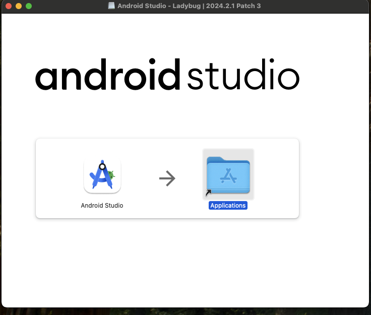

# Running an Existing React Native Application on a Mac for the First Time

This guide is for first-time Mac users who want to run an existing React Native application. It includes the detailed steps I followed. The current date is 1/8/2025, and I’m using the 2024 Mac Mini basic version (the cheapest model). I’ve already successfully run the React Native project on my Windows laptop, where it worked with the Android simulator. Therefore, this guide won’t cover how to build your first React Native app; that’s a separate note.

## 1. Download the Essential Applications

1. **Xcode**: Download it from the App Store.
2. **Visual Studio Code**: Download it from [Visual Studio Code](https://code.visualstudio.com).
3. **Android Studio** (Optional): If you want to run the app on an Android simulator, download it from [Android Studio](https://developer.android.com/studio). In this guide, I’ll focus on running React Native using Xcode and will skip Android Studio.

## 2. Install the Applications

If you’re familiar with using a Mac, you probably know how to install applications. However, as a first-time Mac user, I found this process slightly confusing, so I think these steps will be helpful for others like me.

### Installing Applications from the App Store
- If you download an application from the App Store, the installation process is automatic, and you don’t need to worry about additional steps.

### Installing Applications Downloaded from a Website
If you download an application from a website, the file will typically be saved in the **Downloads** directory. Follow these steps to install it:

1. Open **Finder**. The Finder icon looks like a smiley face (half blue, half gray) and is usually the first icon on the Dock. Alternatively, you can find it at the top left of your screen, next to the Apple icon.
2. In Finder's left sidebar, click on **Downloads**. This is where your downloaded files/folders are located.
3. Double-click the `.dmg` file you downloaded.
4. A pop-up window will appear, showing the app's icon and a shortcut to the **Applications** folder. It will look something like this: 
5. Click and hold the app’s icon (e.g., *Android Studio*).
6. Drag the app icon over to the **Applications** folder in Finder's sidebar.
7. Drop the app into the **Applications** folder to copy it.
8. Once the app finishes copying, double-click it in the **Applications** folder to confirm it was installed successfully.
9. To clean up, locate the `.dmg` file under **Locations** in Finder's sidebar.
10. Click the up arrow to eject the `.dmg` file or right-click on it and select **Eject**.

## 3. Install Dependencies

Before starting, make sure your Mac system and Xcode are up to date. Otherwise, you may get stuck or spend a significant amount of time installing Homebrew and Xcode Command Line Tools. Additionally, the process could consume most of your CPU, as I experienced.

1. **Open Terminal**.
2. **Install [Homebrew](https://brew.sh)**:
   1. Run the following command:
      ```
      /bin/bash -c "$(curl -fsSL https://raw.githubusercontent.com/Homebrew/install/HEAD/install.sh)"
      ```
   2. Enter your password when prompted.
   3. After the installation, add Homebrew to your PATH. Replace `<your username>` with your Mac username:
      ```
      echo >> /Users/<your username>/.zprofile
      echo 'eval "$(/opt/homebrew/bin/brew shellenv)"' >> /Users/<your username>/.zprofile
      eval "$(/opt/homebrew/bin/brew shellenv)"
      ```
   4. Confirm the installation by running:
      ```
      brew help
      ```
3. **Install nvm (Node Version Manager)**:  
   Do not install Node.js directly with Homebrew (`brew install node`) because it will install the latest version of Node.js. Instead, install the LTS (Long Term Support) version:
   1. Run the following command:
      ```
      curl -o- https://raw.githubusercontent.com/nvm-sh/nvm/v0.39.5/install.sh | bash
      ```
   2. Source your shell configuration:
      ```
      source ~/.zshrc
      ```
   3. Install the Node.js LTS version:
      ```
      nvm install --lts
      ```
   4. Use the LTS version:
      ```
      nvm use --lts
      ```
   5. Check the Node.js version to ensure it’s installed:
      ```
      node -v
      ```
4. **Install CocoaPods**:
    ```
    sudo gem install cocoapods
    ```
5. **Add gem to the PATH**:
   1. Run the following to get the **EXECUTABLE DIRECTORY**:
      ```
      gem env
      ```
   2. Edit your shell configuration:
      ```
      nano ~/.zshrc
      ```
   3. Copy the **EXECUTABLE DIRECTORY** value from the previous step and add it to the file.
   4. Save and exit:
      - Press `Ctrl + O` to save.
      - Press `Ctrl + X` to exit.
   5. Apply the changes:
      ```
      source ~/.zshrc
      ```
6. Confirm CocoaPods is added to the PATH by checking its version:
   ```
   pod --version
   ```

---

## 4. Run the React Native App

**Prerequisite**: Ensure you’ve already successfully run the app on another platform or system.

1. **Transfer or Clone Your Project** to your Mac.
2. Open the project in **Visual Studio Code**.
3. Open the integrated terminal in Visual Studio Code.
4. In your project directory, run:
   ```
   npm install
   ```
5. Navigate to the `ios` directory:
   ```
   cd ios
   ```
6. Install CocoaPods dependencies:
   ```
   pod install
   ```
7. Navigate back to the project root directory:
   ```
   cd ..
   ```
8. Start your app on the iOS simulator:
   ```
   npx react-native run-ios
   ```

**Done! Congratulations!** 🎉 Your React Native app is now running on your Mac. Let me know if you encounter any issues or need further assistance!

---

This guide covers everything needed to get started with running an existing React Native application on a Mac using Xcode. Let me know if any additional steps or troubleshooting tips are needed!