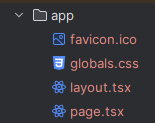

# Next.js notes
---
Tutorial:
- https://www.youtube.com/watch?v=Zq5fmkH0T78
- https://nextjs.org/docs

---
## Some basic concepts...
React originally has two types of components
- functional
- class based

Now, with React 19, components are also categorized by where they run:
- client component (runs on the user's browser)
- server component (runs on the server)

Next.js automatically converts every component you create into a server component unless you explicitly and specifictly instucted not to, only if you need some browser functionalities.

The second Next.js benefit is in the way it handles rendering. It allows you to choose exactly where and when they'll be rendered, optimizing the performance even further.
- client-side rendering, which happens on your browser
- server-side rendering, which involves rendering the web page on the server before transimitting to your browser. This significantly improve your website's search engine optimization.

The next Next.js benefit is routing.
React.js need to install additional React Router pacakge to create routes, while Next.js doesn't.
Next.js has file based routing. Each folder's name becomes a route path.

The next benefit is Next.js has evolved from a smple frontend library to a full stack framework.

Next.js automates code splitting by default. When a user navigates to a different page, only the code for that page is loaded, which significantly speeds up page load times.

and more...

---

## Start Project
```
npx create-next-app@latest
```


### File and folder structure explain:
    
1. 📁 app/
Next.js 13+ App Router folder.
Contains page components, layouts, templates, route segments, etc.
Replaces the older `pages/` directory.
    In the app/
    1. 🎯 page.tsx
        This is the main route page for /.
        Similar to pages/index.tsx in the old Pages Router.
        Acts as the content area rendered inside layout.tsx.

        🧠 Think of it as:
        ➡️ GET / → loads page.tsx within layout.tsx

    2. 🧱 layout.tsx
        Required in every route segment.
        Defines the shared layout structure, like headers, footers, <html>, <body>, and global styling.

        Must include:

        > export default function RootLayout({ children }: { children: React.ReactNode }) {
        return (
            <html lang="en">
            <body>{children}</body>
            </html>
        );
        }
        
        📌 Without this, Next.js will throw an error.

    3. 🎨 globals.css
        Your global CSS styles.
        Usually imported in layout.tsx like:
        >import './globals.css';
        Useful for Tailwind base layers, global resets, fonts, etc.

    4. 🖼️ favicon.ico
        Your site's favicon.
        Linked automatically when placed in app/.
        No need to manually add <link rel="icon"> — Next.js handles it.

2. 📁 node_modules/
Stores all installed NPM packages.
Automatically created by npm install.
You shouldn’t edit anything here manually.

3. 📁 public/
Static assets folder.
Anything here is served at the root (/favicon.ico → /favicon.ico)
Good for: favicons, images, robots.txt, etc.

4. ⚪ .gitignore
Lists files/folders to exclude from Git version control.
Common entries: node_modules/, .env, .next/

5. ⚙️ eslint.config.mjs
ESLint configuration using ES modules syntax.
Controls linting rules and behavior (e.g., warning for unused vars, formatting style).

6. 🧭 next.config.ts
Main configuration file for Next.js
Written in TypeScript (.ts)
Used to set:
    - Images domains
    - Redirects
    - Environment variables
    - Experimental features

7. 🧾 next-env.d.ts
TypeScript types auto-generated by Next.js.
Ensures you can import .css, .png, etc., without TS errors.
Don’t modify this file manually — it's managed by Next.js.

8. 📦 package.json
Defines the project metadata and dependencies.
Contains:
    - Project name, scripts (e.g., dev, build)
    - Installed packages
    - Version requirements
Run npm install to install these dependencies.

9. 📦 package-lock.json
Auto-generated when you run npm install.
Records exact versions of installed packages.
Ensures consistent installs across machines.

10. ⚙️ postcss.config.mjs
Config for PostCSS, a tool used to process css with different plugins.
Handles CSS transformation at build time.

11. 📄 README.md
Markdown file describing your project.
Useful for documentation, instructions, repo overviews.

12. 🧠 tsconfig.json
TypeScript compiler configuration.
Controls:
    - Path aliases
    - Module resolution
    - Type checking behavior
Used by both Next.js + your IDE for autocomplete and type safety.

## Run the app
```
npm run dev
```