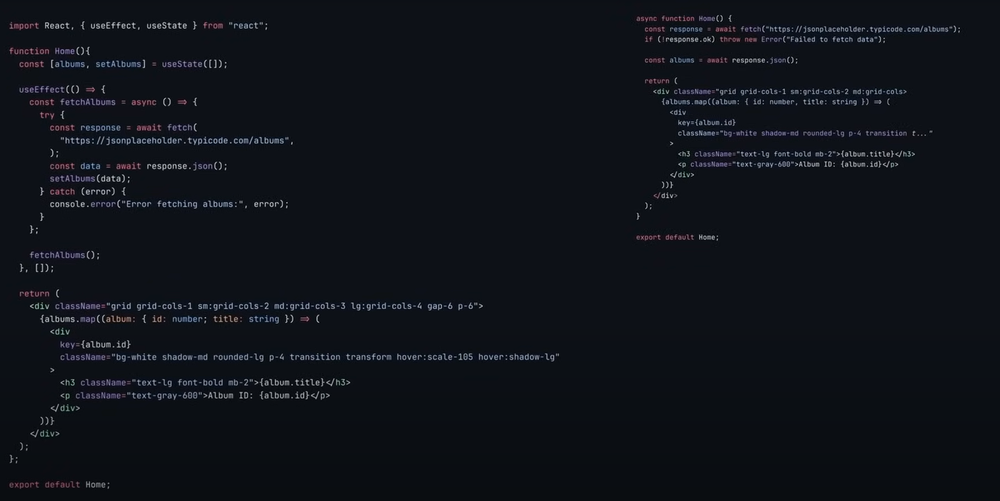

# Next.js Notes
---
Tutorial:
- https://www.youtube.com/watch?v=Zq5fmkH0T78
- https://nextjs.org/docs

---
## Some basic concepts...
### Components
React originally has two types of **components**
- **functional**
- **class based**

Now, with React 19, components are also categorized by where they run:
- **client component** (runs on the user's browser)
    - to use them in Hext.js, use `'use client'` on the top of component.
    - server components are rendered only on the server side, while client components are pre-rendered on the server side (**server-side pre-rendering**) to create a static shell and then hydrate it on the client side.
        - This means everything within the client components that doesn't require interactivity or isn't dependent on the browser is still rendered on the server. 
        - the code or parts that rely on the browser or require intereactivity are left as placeholders during server side pre-rendering. When they reach the client, the browser then renders the client components and dills in the placeholders left by the server.
- **server component** (runs on the server)
    - reduce the amount of Javascript sent to the browser, hence improve performance
    - can direct access the server resources
    - keep sensitive information sensitive
    - Why not everything is server componenet? -- If handle user interaction, then you need client components
  
When should you allow Next.js to turn your components into server side components and when should you manually change them to client side?
- leave it as server side component until you need some browser interactivity, at which point you'll most likely get an error and then you can add `use client` at the top.
- Refer: https://nextjs.org/docs/app/getting-started/server-and-client-components


Next.js automatically converts every component you create into a server component unless you explicitly and specifictly instucted not to, only if you need some browser functionalities.

### Rendering
The second Next.js benefit is in the way it handles **rendering**. It allows you to choose exactly where and when they'll be rendered, optimizing the performance even further.
- **client-side rendering**, which happens on your browser
- **server-side rendering**, which involves rendering the web page on the server before transimitting to your browser. This significantly improve your website's search engine optimization.

#### Partial Rendering
Next.js automates code splitting by default. When a user navigates to a different page, only the code for that page is loaded, which significantly speeds up page load times.

#### Partial Prerendering (PPR)
- A new rendering model that combines static and dynamic rendering.
- It allows you to render a static shell of page while streaming dynamic content.
- Key difference: It allows for a hybrid approach within a single page, unlike other strategies that work on a page level
- How it works:
  - During build time, Next.js generates a static shell of the pages. This shell includes layout and any static parts of the page in the form of components. This static shell includes placeholders for dynamic content. 
  - We do it by warpping dynamic components in a `<Suspend />` tag. 
  - When a user requests a page, the static shell is server immediately, and then the dynamic content is streamed in as it becomes available.
- With PPR, you can have static components, dynamic components, and partially static and partially dynamic components depending on waht you need.

### Routing
The next Next.js benefit is **routing**.
React.js need to install additional React Router pacakge to create routes, while Next.js doesn't.
Next.js has file based routing. Each folder's name becomes a route path.
- folder name + page.tsx = route

#### Dynamic routes
- [folder name] + page.tsx

#### Route groups
They allow you to organize your route segments and project structure without impacting the URL path.
Can have separate layouts for different route groups which are going to give you different UI but witht affecting the URL.
- (folder name) + folder name + page.tsx

### Full Stack Framework
The next benefit is Next.js has evolved from a simple frontend library to a full stack framework.


### Error handling
Special file called `error.js or tsx` -- catches errors and displays them on the UI
Can create error files specific to different routes
Global error handling: `global-error.tsx` in the root of the app folder
Only closest error file to the route takes priority.

```
"use client"; //Error boundaries must be client components

export default function GlobalError({
                                        error,
                                    }: {
    error: Error & { digest?: string };
}) {
    return (
        // global-error must include html and body tags
        <html>
        <body>
        <h2>Global Error</h2>
        </body>
        </html>
    )
}
```

### Loading UIs
Loading UIs in Next.js works very similarly to error handling
`loading.tsx`

### Data fetching
Client side fetching vs. Server side fetching


Benefits of server side fetching:
- Improve initial load time. As a server side data fetching allows the page to be rendered with the data already includes, it reduces the time to First Contentful Paint (FCP)
- Better SEO. Search Engine Crawlers can more easily index content rendered on the server as the content is already provided in HTML format. In contast, client side fetching may result in content not being visible to crawlers right away, since it first needs to be fetched and then displayed on the UI, which can negatively impact your SEO.
- Shorter code and simplified logic
- Automatic request deduplication. improve performance and reduce unnecessary API calls. Reuqest deduplication makes sure that when the same data is requested multiple times at once, only one request is sent. It stops duplicate requests from being made
- Improved security.
- Reduced network waterfall. Client side fetching often leads to a network waterfall where requests are made sequentially. Server side feching can more efficiently parallelize those requests
- Can make direct database calls (React server components)

#### Server side data fetching strategies
1. Static Site Generation (SSG). 
   1. A technique where HTML pages are generated at build time. This means that the content is created when you deploy your site, not when a user requests it.
   2. It's extremely fast and can be serverd from a CDN (Content Delivery Network), but it's not suitable for websites that need frequently updated content.
   3. By default, Next.js uses a static rendering strategy. The result is cached and can be pushed to a CDN.
   4. Ideally, you want to use this strategy for blogs, documentation sites, or marketing pages.
2. Incremental Static Regneration (ISR)
   1. An extension of SSG that allows you to update static content after you've built your site. This means that it'll create static pages in build time behaving like SSG, and then after some time has passed, it'll create or update those static pages once again after you've deployed your site.
   2. Basically, it combines the benefits of static generation with the ability to refresh and update content.
   3. For content changes occasionally but still doesn't need realtime updates
   4. Two ways:
      1. Time-based revalidation
         1. revalidate your entire page (including all data fetching within it) after some time by simply exporting `export const revalidate = 3600 // invalidate every hour`
         2. Revalidate the request (the specific data fetch) after some time: `const data = await fetch("https://api/vercel.app/blog", {next: {revalidate: 3600}});`
          - Differences:
            - The first one is route segment config, while the second one uses next revalidate option in the fetch function
            - The first one will revalidate the entire page, while the second one only revalidate the specific request and other parts within the page are not affected at all.
      2. On-demand revalidation with 
         1. `revalidatePath`
         2. `revalidateTag`
3. Server side rendering (SSR)
   1. It generates the HTML for a page on the server in response to a user's request. This means the content is created dynamically for each user request, and not only for each deployment.
   2. It's slower than SSG and puts more load on the server, but you'll always have up-to-date content
   3. Ideal for highly dynamic content or pages that need real-time data
   4. Similar to ISR, you can use the same configs for SSR for Time-based revalidation, setting it to 0. Similar for On-demand revalidation

### API routes
- `route.js or route.ts`

### Search Engine Optimization
- Specifically, how we use metadata in Next.js to improve our SEO.
  - Metadata -- look and feel of a website when we share with others on messaging platform or social medial platform or on internet in general
- Two ways:
  1. Config based: create a JavaScript object into the layout or any kind of page file and export it
    - Static:
        ```
        export const metadata: Metadata = {
            title: "Home | Next.js",
            description: "Generated by create next app",
        };
        ```
  - You can define unique metadata for each route or rely on the metadata from the root layout
  - Dynamic:
    ```
    export async function generateMetadata({ params }){
        const { id } = params;
        const resource = await getResourceById({ id });

        ...

        return {
            title,
            description: seoDescription,
            other: {
                "og:title": title,
                "og:description": seoDescription,
                "og:image": resource.image,
                ...
            }
        }
    }
    ```
  2. File based metadata
    - have to have a proper name directly inside the `app` folder
    - https://nextjs.org/docs/app/getting-started/metadata-and-og-images
    - File based metadata has higher priority and will overwrite any config based metadata.
  

and more...

---

## Start Project
```
npx create-next-app@latest
```


### File and folder structure explain:
    
1. 📁 app/
Next.js 13+ App Router folder.
Contains page components, layouts, templates, route segments, etc.
Replaces the older `pages/` directory.
    In the app/
    1. page.tsx
        This is the main route page for /.
        Similar to pages/index.tsx in the old Pages Router.
        Acts as the content area rendered inside layout.tsx.

        Think of it as:
        GET / → loads page.tsx within layout.tsx

    2. layout.tsx
        Required in every route segment.
        Defines the shared layout structure, like headers, footers, <html>, <body>, and global styling.

        Must include:

        > export default function RootLayout({ children }: { children: React.ReactNode }) {
        return (
            <html lang="en">
            <body>{children}</body>
            </html>
        );
        }
        
        Without this, Next.js will throw an error.
        Acts like a parent for all of routes, It allows you to share UI elements across multiple pages (navbar, footer)

    3. globals.css
        Your global CSS styles.
        Usually imported in layout.tsx like:
        >import './globals.css';
        Useful for Tailwind base layers, global resets, fonts, etc.

    4. favicon.ico
        Your site's favicon.
        Linked automatically when placed in app/.
        No need to manually add <link rel="icon"> — Next.js handles it.

2. 📁 node_modules/
Stores all installed NPM packages.
Automatically created by npm install.
You shouldn’t edit anything here manually.

3. 📁 public/
Static assets folder.
Anything here is served at the root (/favicon.ico → /favicon.ico)
Good for: favicons, images, robots.txt, etc.

4. ⚪ .gitignore
Lists files/folders to exclude from Git version control.
Common entries: node_modules/, .env, .next/

5. ⚙️ eslint.config.mjs
ESLint configuration using ES modules syntax.
Controls linting rules and behavior (e.g., warning for unused vars, formatting style).

6. 🧭 next.config.ts
Main configuration file for Next.js
Written in TypeScript (.ts)
Used to set:
    - Images domains
    - Redirects
    - Environment variables
    - Experimental features

7. 🧾 next-env.d.ts
TypeScript types auto-generated by Next.js.
Ensures you can import .css, .png, etc., without TS errors.
Don’t modify this file manually — it's managed by Next.js.

8. 📦 package.json
Defines the project metadata and dependencies.
Contains:
    - Project name, scripts (e.g., dev, build)
    - Installed packages
    - Version requirements
Run npm install to install these dependencies.

9. 📦 package-lock.json
Auto-generated when you run npm install.
Records exact versions of installed packages.
Ensures consistent installs across machines.

10. ⚙️ postcss.config.mjs
Config for PostCSS, a tool used to process css with different plugins.
Handles CSS transformation at build time.

11. 📄 README.md
Markdown file describing your project.
Useful for documentation, instructions, repo overviews.

12. 🧠 tsconfig.json
TypeScript compiler configuration.
Controls:
    - Path aliases
    - Module resolution
    - Type checking behavior
Used by both Next.js + your IDE for autocomplete and type safety.

---

## Run the app
```
npm run dev
```